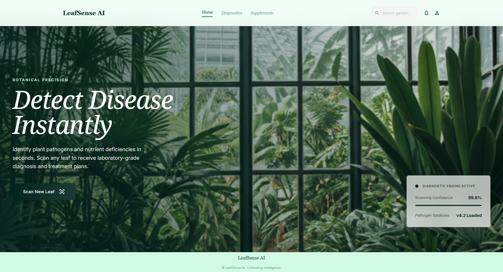
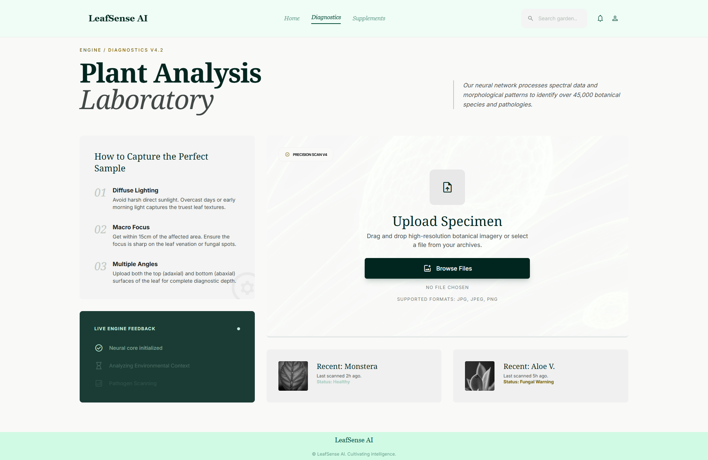
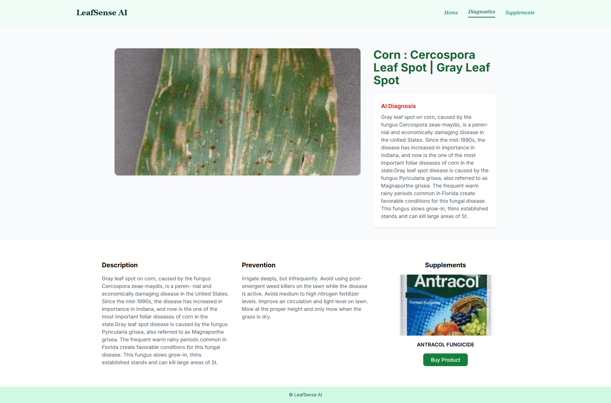
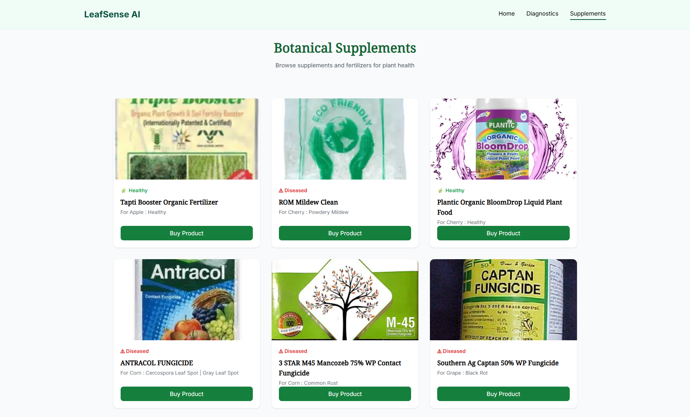

# 🌿 LeafSense AI — Plant Disease Detection System

> An AI-powered web application that detects plant leaf diseases using Deep Learning and provides actionable insights for farmers.

---

## 🚀 Overview

LeafSense AI is a deep learning-based system that classifies plant leaf images into **39 different disease categories** using a **Convolutional Neural Network (CNN)** built with PyTorch.

The goal of this project is to assist farmers and agricultural professionals in **early disease detection**, improving crop yield and reducing losses.

---

## 🧠 Features

* 🌱 Detects plant diseases from leaf images
* 🧪 Classifies into **39 categories**
* ⚡ Fast prediction using trained CNN model
* 🌐 User-friendly web interface (Flask)
* 🛒 Integrated supplements/fertilizer suggestion module
* 🧾 Ready-to-use test dataset for validation

---

## 🛠️ Tech Stack

`Python`, `Flask`, `PyTorch`, `HTML`, `CSS`, `Bootstrap`, `NumPy`, `PIL`

---

## 📂 Project Structure

```
LeafSense-AI/
│
├── Flask Deployed App/
│   ├── app.py
│   ├── plant_disease_model_1.pt
│   └── templates/
│
├── Model/
│   └── training_notebook.ipynb
│
├── test_images/
│
├── requirements.txt
└── README.md
```

---

## ⚙️ Installation & Setup

### 🔹 Prerequisites

* Python **3.8+**
* pip

---

### 🔹 Steps to Run Locally

```bash
# Clone the repository
git clone https://github.com/your-username/LeafSense-AI.git

# Navigate to project directory
cd LeafSense-AI

# Create virtual environment
python -m venv venv

# Activate virtual environment
# Windows
venv\Scripts\activate
# Mac/Linux
source venv/bin/activate

# Install dependencies
pip install -r requirements.txt
```

---

### 🔹 Add Pre-trained Model

Download the trained model:

👉 https://drive.google.com/drive/folders/1ewJWAiduGuld_9oGSrTuLumg9y62qS6A?usp=share_link

Place the file:

```
plant_disease_model_1.pt
```

Inside:

```
Flask Deployed App/
```

---

### 🔹 Run the Application

```bash
cd Flask Deployed App
python app.py
```

Open in browser:

```
http://127.0.0.1:5000/
```

---

## 🧪 Testing

* Use sample images from the `test_images/` folder
* Each image includes its correct disease label
* Helps validate model predictions

---

## 🌐 Live Demo

🔗 https://plant-disease-detection-ai.herokuapp.com/

---

## 📸 Application Preview

### 🏠 Home Page



### 🤖 AI Engine



### 📊 Results Page



### 🛒 Supplements Store



---

## 🤝 Contributing

We welcome contributions!

### 💡 You can contribute by:

* Improving UI/UX 🎨
* Enhancing model accuracy 🤖
* Adding new features 🚀
* Improving documentation 📄

### 🔄 Steps to Contribute:

1. Fork the repository
2. Create a new branch
3. Make your changes
4. Test your code
5. Submit a Pull Request

📌 Guide: https://opensource.com/article/19/7/create-pull-request-github

---

## 📊 Dataset

* PlantVillage Dataset used for training
* Contains labeled plant disease images

---

## 📌 Future Improvements

* 📱 Mobile app version
* ☁️ Cloud deployment (AWS/GCP)
* 🔍 Real-time camera detection
* 📈 Disease severity prediction
* 🌾 Crop recommendation system

---

## 👨‍💻 Author

**Pradeep A V A**
AI Engineer | Full-Stack Developer

---

## ⭐ Support

If you like this project:

⭐ Star the repo
🍴 Fork it
📢 Share it

---

